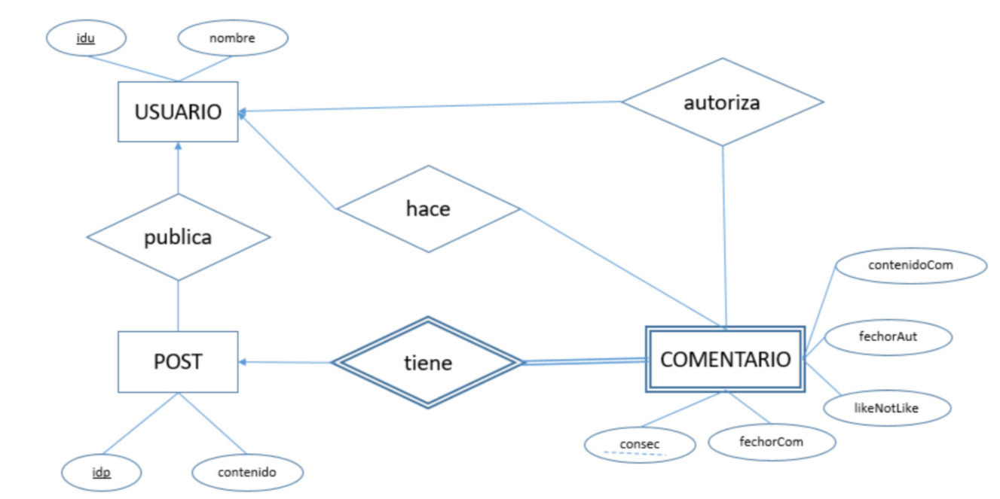

# neo4j-crud

Se implementa el modelo relacional del sistema de una red social simplificada en el gestor de bases de datos NEO4J. 

* Se utiliza Node+Express.JS en el servidor. Este expone endpoints para el CRUD de los nodos, utilizando el driver de neo4j conectado a una instancia.

* Se implementa una aplicación web para el consumo de dichas funciones en una experiencia de usuario cotidiana.

El despliegue de las aplicaciones se realiza por separado y secomunican por medio de variables de entorno. Ver los directorios para mayor información.
